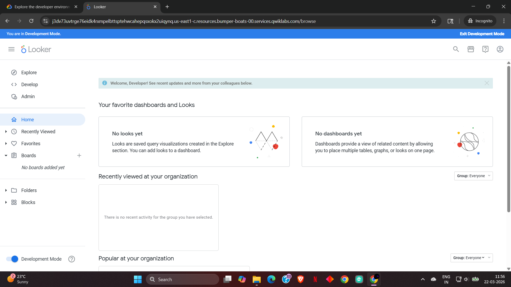
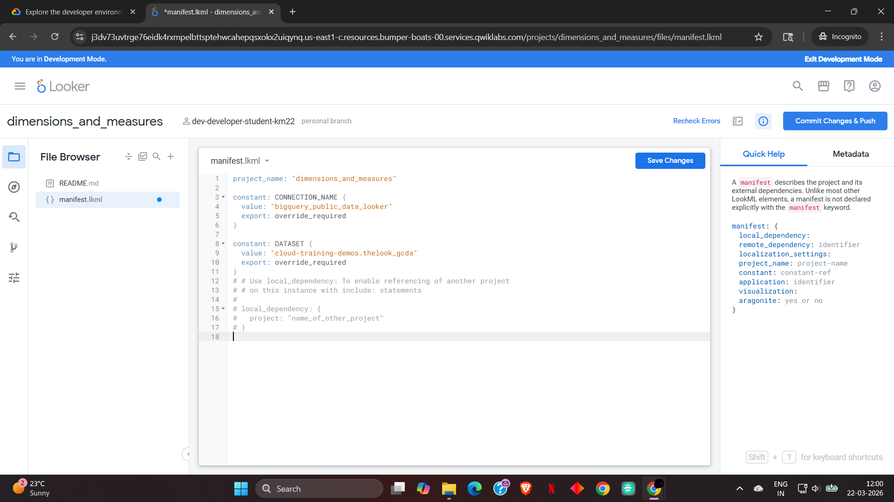
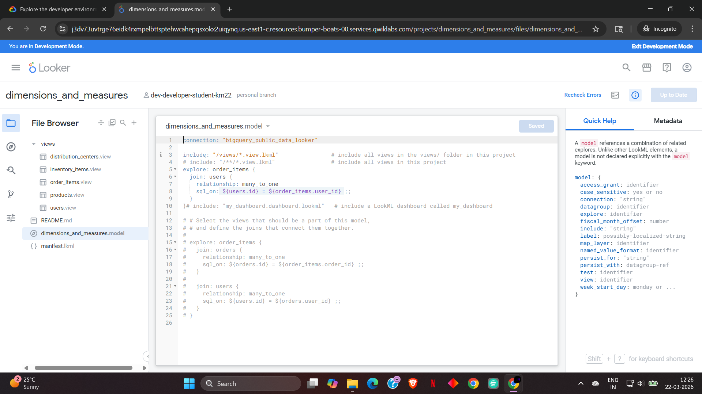
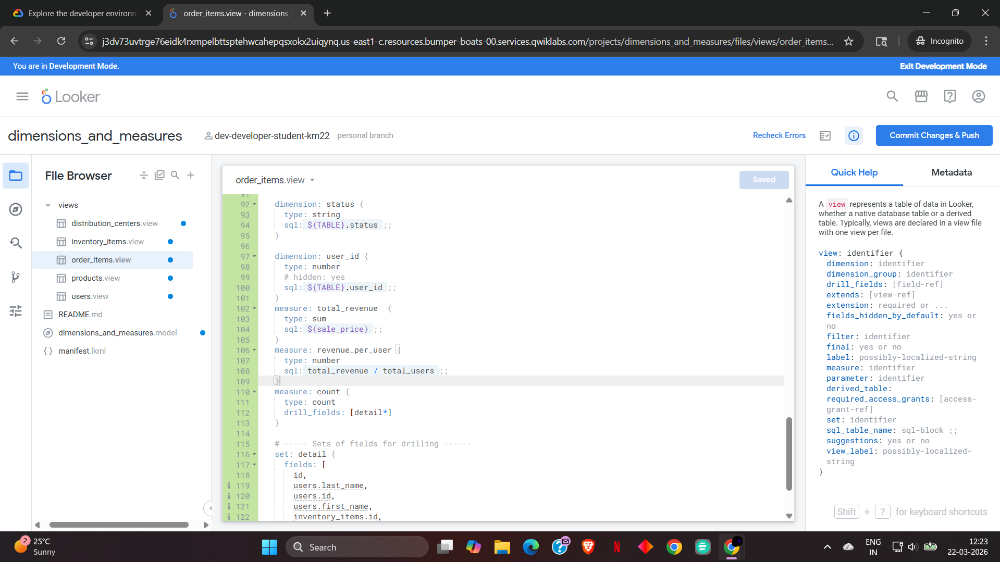
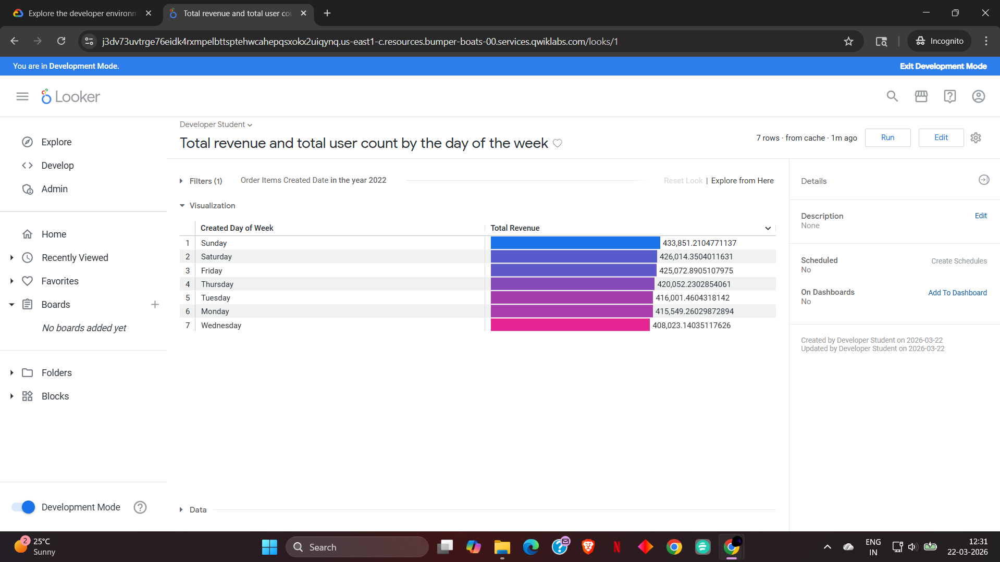

# 📊 Looker LookML Revenue Analytics

## 🚀 Project Overview

This project demonstrates the implementation of **LookML (Looker Modeling Language)** to design a structured data model and analyze business performance using a cloud-based dataset from **Google BigQuery**.

---
## 🧠 Business Problem

An e-commerce company wants to analyze revenue patterns and user behavior to improve business performance. Specifically, the company aims to:

* Identify which days generate the highest revenue
* Understand how user activity impacts revenue
* Detect patterns in purchasing behavior over time

The goal is to build a scalable data model and generate actionable insights to support data-driven decision-making.

---

## 🏗️ Data Model

* **order_items** → Fact table (transactions)
* **users** → Dimension table

**Relationship:**
One user → many orders

---

## 🛠️ Tech Stack

* Looker (LookML IDE)
* Google BigQuery
* SQL (via LookML)

---

## ⚙️ Implementation

### 🔹 1. Development Environment

Looker Development Mode enabled



---

### 🔹 2. Manifest Configuration

Defines project-level constants and connection



---

### 🔹 3. Model & Relationships

Defines joins between tables



---

### 🔹 4. Measures Implementation

```lookml id="yo1gcz"
measure: total_revenue {
  type: sum
  sql: ${sale_price} ;;
}

measure: revenue_per_user {
  type: number
  sql: total_revenue / total_users ;;
}
```



---

### 🔹 5. Final Visualization

Revenue by Day of Week



---

## 📈 Insights & Findings

* Revenue is highest on weekends (Saturday & Sunday)
* Mid-week performance is lower
* Consistent user purchasing patterns observed

👉 **Recommendation:**
Run promotions on low-performing days to increase revenue

---

## 🧠 Skills Demonstrated

* LookML Data Modeling
* SQL Aggregations
* Business Intelligence (Looker)
* Data Analysis

---

## 🎯 Conclusion

This project demonstrates how LookML enables scalable data modeling and transforms raw data into actionable business insights.

---
